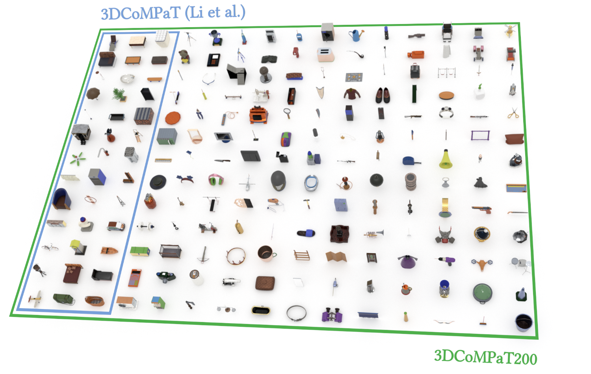

<div align="center">
<h1 align="center">
</h1>
<h1 align="center">
    3DCoMPaT200: Language Grounded Large-Scale 3D Vision Dataset for Compositional Recognition
</h1>


[](https://openreview.net/pdf?id=L4yLhMjCOR)
[](https://3dcompat-dataset.org/doc/)
[](https://huggingface.co/datasets/CoMPaT/3DCoMPaT200)

</div>

## 📰 News

- **13/11/2024**: The Paper got accepted in Neurips 2024 Benchmark track🎉

## Summary

- [Introduction](#introduction)
- [Acknowledgments](#acknowledgments)
- [Citation](#citation)

<br>


<br>

## Introduction

3DCoMPaT200 is a multimodal 2D/3D dataset of 30 million rendered views of more than 19 million stylized 3D shapes carefully annotated at **part-instance** level, alongside matching **RGB pointclouds**, **3D textured meshes**, **depth maps**, **segmentation masks** and **textual descriptions**. This work builds upon [3DCoMPaT++](https://3dcompat-dataset.org/v2/), the second version of this dataset.

</br>


## Acknowledgments

⚙️ For computer time, this research used the resources of the Supercomputing Laboratory at [King Abdullah University of Science & Technology (KAUST)](https://www.kaust.edu.sa/).
We extend our sincere gratitude to the [KAUST HPC Team](www.hpc.kaust.edu.sa) for their invaluable assistance and support during the course of this research project. Their expertise and dedication continues to play a crucial role in the success of our work.

</br>

## Citation

If you use our dataset, please cite the three following references:

```bibtex
@inproceedings{
ahmed2024dcompat,
title={3{DC}o{MP}aT200: Language Grounded Large-Scale 3D Vision Dataset for Compositional Recognition},
author={Mahmoud Ahmed and Xiang Li and Arpit Prajapati and Mohamed Elhoseiny},
booktitle={The Thirty-eight Conference on Neural Information Processing Systems Datasets and Benchmarks Track},
year={2024},
url={https://openreview.net/forum?id=L4yLhMjCOR}
}
```

```bibtex
@article{slim2023_3dcompatplus,
    title={3DCoMPaT++: An improved Large-scale 3D Vision Dataset
    for Compositional Recognition},
    author={Habib Slim, Xiang Li, Yuchen Li,
    Mahmoud Ahmed, Mohamed Ayman, Ujjwal Upadhyay
    Ahmed Abdelreheem, Arpit Prajapati,
    Suhail Pothigara, Peter Wonka, Mohamed Elhoseiny},
    year={2023}
}
```

```bibtex
@article{li2022_3dcompat,
    title={3D CoMPaT: Composition of Materials on Parts of 3D Things},
    author={Yuchen Li, Ujjwal Upadhyay, Habib Slim,
    Ahmed Abdelreheem, Arpit Prajapati,
    Suhail Pothigara, Peter Wonka, Mohamed Elhoseiny},
    journal = {ECCV},
    year={2022}
}
```

</br>

