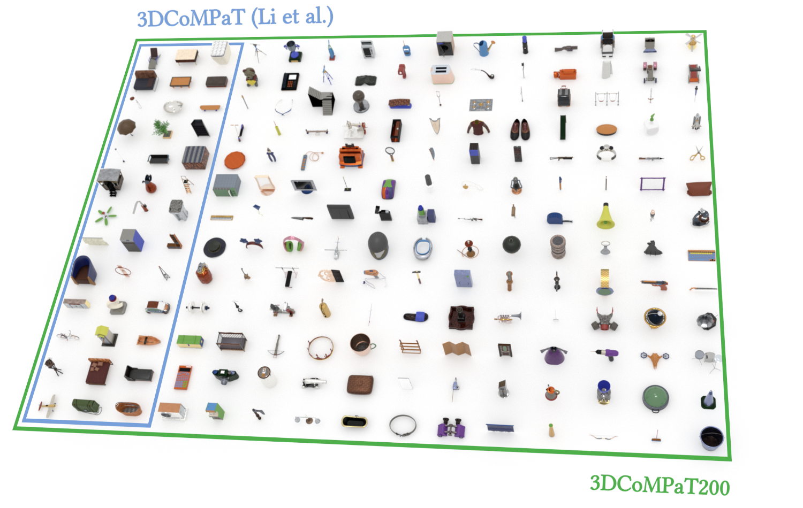

<div align="center">
<h1 align="center">
</h1>
<h1 align="center">
    3DCoMPaT200: Language Grounded Large-Scale 3D Vision Dataset for Compositional Recognition
</h1>


[](https://openreview.net/pdf?id=L4yLhMjCOR)
[](https://3dcompat-dataset.org/doc/)
[](https://huggingface.co/datasets/CoMPaT/3DCoMPaT200)

</div>

## 📰 News

- **13/11/2024**: The Paper got accepted in Neurips 2024 Benchmark track🎉

## Summary

- [Introduction](#introduction)
- [Acknowledgments](#acknowledgments)
- [Citation](#citation)

<br>


<br>

## Introduction

3DCoMPaT200 is a multimodal 2D/3D dataset of 30 million rendered views of more than 19 million stylized 3D shapes carefully annotated at **part-instance** level, alongside matching **RGB pointclouds**, **3D textured meshes**, **depth maps**, **segmentation masks** and **textual descriptions**. This work builds upon [3DCoMPaT++](https://3dcompat-dataset.org/v2/), the second version of this dataset.

</br>

## Shape Classification

| Model                   | Instance Accuracy (%) | Class Average Accuracy (%) |
|-------------------------|-----------------------|----------------------------|
| PointNet++ [24]         | **88.32**            | **89.02**                 |
| PCT [25]                | 71.71                | 71.50                     |
| CurveNet [26]           | 86.00                | 86.77                     |
| PointBert [27]          | 87.65                | 87.84                     |
| PointTransformer V2 [28]| 85.95                | 86.35                     |
| PointTransformer V3 [29]| **88.48**            | **89.79**                 |


## Part Segmentation

| Model                   | Shape Prior | Fine Grained Accuracy (%) | Fine Grained mIoU (%) | Coarse Grained Accuracy (%) | Coarse Grained mIoU (%) |
|-------------------------|-------------|---------------------------|------------------------|-----------------------------|--------------------------|
| PointNet++              | ✅          | 80.39                    | 54.34                 | 92.30                      | 77.55                   |
| PointNet++              | ❌          | 70.30                    | 45.44                 | 65.25                      | 43.35                   |
| PCT                     | ✅          | 86.21                    | **81.83**             | **96.42**                  | **91.83**               |
| PCT                     | ❌          | 62.46                    | 48.70                 | 84.74                      | 76.61                   |
| Curvenet                | ✅          | 83.07                    | 59.69                 | 93.64                      | 80.42                   |
| Curvenet                | ❌          | 71.36                    | 50.97                 | 88.08                      | 72.74                   |
| PointBert               | ❌          | 81.07                    | 62.93                 | 93.00                      | 82.43                   |
| PointTransformer V2     | ❌          | 82.80                    | 45.15                 | 87.52                      | 42.73                   |
| PointTransformer V3     | ❌          | **87.51**                | 61.37                 | 94.45                      | 74.09                   |

## Material Segmentation

| Model                   | Fine Grained Accuracy (%) | Fine Grained General mIoU (%) | Coarse Grained Accuracy (%) | Coarse Grained General mIoU (%) |
|-------------------------|---------------------------|-------------------------------|-----------------------------|---------------------------------|
| PointNet++              | 97.98                    | 94.17                         | 98.68                      | 96.42                           |
| PCT                     | 99.79                    | **98.88**                     | 99.65                      | **99.07**                       |
| CurveNet                | 85.07                    | 74.26                         | 68.75                      | 62.04                           |
| PointBert               | 96.90                    | 89.28                         | 97.59                      | 91.81                           |
| PointTransformer V2     | **99.56**                | 98.32                         | 99.53                      | 96.75                           |
| PointTransformer V3     | **99.48**                | 98.54                         | **99.76**                  | 98.30                           |

## GCR Metrics

### Fine-Grained Results

| Model                   | Prior | Shape Acc. (%) | Value (%) | Value-All (%) | Grounded-Value (%) | Grounded-Value-All (%) |
|-------------------------|-------|----------------|-----------|---------------|---------------------|------------------------|
| PointNet++              | ✅    | 88.20          | 68.21     | 34.60         | 53.39               | 17.95                  |
| PointNet++              | ❌    | 62.02          | 27.15     | 46.42         | 14.09               |
| PCT                     | ✅    | 71.59          | 57.92     | 33.96         | 53.77               | 26.22                  |
| PCT                     | ❌    | 43.18          | 17.31     | 37.32         | 11.67               |
| CurveNet                | ✅    | 86.04          | 61.09     | 24.96         | 46.41               | 13.76                  |
| CurveNet                | ❌    | 58.29          | 22.43     | 41.87         | 11.23               |
| PointBert               | ✅    | 87.65          | 73.46     | 46.96         | 62.86               | 29.21                  |
| PointTransformer V2     | ✅    | 85.95          | 70.35     | 40.68         | 60.98               | 26.35                  |
| PointTransformer V3     | ✅    | **88.48**      | **75.72** | **51.65**     | **71.84**           | **42.80**              |

---

### Coarse-Grained Results

| Model                   | Prior | Shape Acc. (%) | Value (%) | Value-All (%) | Grounded-Value (%) | Grounded-Value-All (%) |
|-------------------------|-------|----------------|-----------|---------------|---------------------|------------------------|
| PointNet++              | ✅    | 88.20          | 81.41     | 70.75         | 75.10               | 58.49                  |
| PointNet++              | ❌    | 55.89          | 32.93     | 42.09         | 19.14               |
| PCT                     | ✅    | 71.59          | 68.23     | 63.88         | 66.85               | 60.58                  |
| PCT                     | ❌    | 60.75          | 25.54     | 57.10         | 44.83               |
| CurveNet                | ✅    | 86.04          | 54.44     | 34.22         | 46.86               | 24.39                  |
| CurveNet                | ❌    | 56.17          | 32.47     | 46.86         | 27.32               |
| PointBert               | ✅    | 87.65          | 81.88     | 75.74         | 77.63               | 66.80                  |
| PointTransformer V2     | ✅    | 85.95          | 71.85     | 61.71         | 66.23               | 46.49                  |
| PointTransformer V3     | ✅    | **88.48**      | **82.62** | **77.77**     | **80.34**           | **72.91**              |


## Acknowledgments

⚙️ For computer time, this research used the resources of the Supercomputing Laboratory at [King Abdullah University of Science & Technology (KAUST)](https://www.kaust.edu.sa/).
We extend our sincere gratitude to the [KAUST HPC Team](www.hpc.kaust.edu.sa) for their invaluable assistance and support during the course of this research project. Their expertise and dedication continues to play a crucial role in the success of our work.

</br>

## Citation

If you use our dataset, please cite the three following references:

```bibtex
@inproceedings{ahmed2024dcompat,
title={3{DC}o{MP}aT200: Language Grounded Large-Scale 3D Vision Dataset for Compositional Recognition},
author={Mahmoud Ahmed and Xiang Li and Arpit Prajapati and Mohamed Elhoseiny},
booktitle={The Thirty-eight Conference on Neural Information Processing Systems Datasets and Benchmarks Track},
year={2024},
url={https://openreview.net/forum?id=L4yLhMjCOR}
}
```

```bibtex
@article{slim2023_3dcompatplus,
    title={3DCoMPaT++: An improved Large-scale 3D Vision Dataset
    for Compositional Recognition},
    author={Habib Slim, Xiang Li, Yuchen Li,
    Mahmoud Ahmed, Mohamed Ayman, Ujjwal Upadhyay
    Ahmed Abdelreheem, Arpit Prajapati,
    Suhail Pothigara, Peter Wonka, Mohamed Elhoseiny},
    year={2023}
}
```

```bibtex
@article{li2022_3dcompat,
    title={3D CoMPaT: Composition of Materials on Parts of 3D Things},
    author={Yuchen Li, Ujjwal Upadhyay, Habib Slim,
    Ahmed Abdelreheem, Arpit Prajapati,
    Suhail Pothigara, Peter Wonka, Mohamed Elhoseiny},
    journal = {ECCV},
    year={2022}
}
```

</br>

